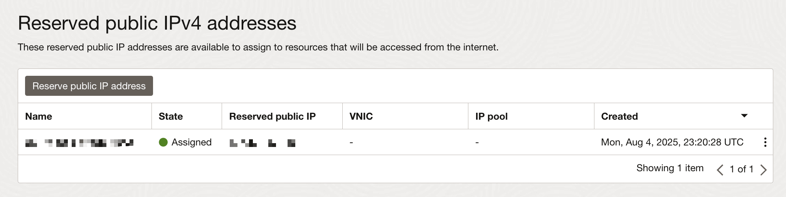

# 1. Oracle Compute Instance에 고정 IP 할당하기
- 2025-10-08 기준 내용
1. Hamburger 메뉴 버튼 클릭
2. Networking
3. IP management
4. Reserved public IPs
5. Reserve public IP address 버튼 클릭
6. 내용 작성하여 등록
7. 고정 IP 할당 결과



# 2. ~.ssh/config에서 간단 접속 설정
1. 터미널에서 `nano ~/.ssh/config` 실행하여 config 편집
```config
Host 사용할_호스트_이름
    # Public IP
    HostName 000.000.000.000
    Port 00000
    # 서버 유저
    User user_account_name
    # Private key 경로
    IdentityFile /Users/..../private.key

    # 연결 유지 (끊김 방지)
    ## 60초마다 null packet을 보내서 연결이 끊기지 않게 유지
    ServerAliveInterval 60
    ## ServerAliveInterval에 설정된 간격으로 신호를 보냈는데 서버로부터 응답이 없을 경우, 몇 번까지 더 시도할지를 결정
    ServerAliveCountMax 3

    # 연결 재사용 (속도 향상)
    ControlMaster auto
    ControlPath ~/.ssh/controlmasters/%r@%h:%p
    ControlPersist 10m

    # 접속 시도 타임아웃
    ConnectTimeout 10

    # 보안 관련 옵션
    ## X11 Forwarding(GUI 프로그램 실행) 기능을 비활성화. 서버에서 GUI 애플리케이션을 사용할 일이 없다면 꺼두는 것이 보안에 좋음
    ForwardX11 no
    ## 내 PC → Bastion 서버 (Public IP) → Private 서버 (Private IP) 이런 접속 구조가 필요할 때에는 SSH Agent Forwarding이 필요
    ## 하지만 저런 구조에서 사용할 일이 없으므로 끈다.
    ForwardAgent no
```
2. 각 항목에 대한 설명
- 연결 유지
  - ServerAliveInterval 60 : 60초마다 null packet을 보내서 연결이 끊기지 않게 유지
  - ServerAliveCountMax 3 : ServerAliveInterval에 설정된 간격으로 신호를 보냈는데 서버로부터 응답이 없을 경우, 몇 번까지 더 시도할지를 결정. 3번의 시도에도 서버가 응답하지 않으면, 클라이언트는 서버에 문제가 생겼거나 네트워크 연결이 끊어졌다고 판단하고 SSH 접속을 스스로 종료.
- 연결 재사용 (속도 향상)
  - ControlMaster auto : 특정 호스트에 대한 첫 SSH 연결이 "마스터(Master)" 연결이 되어, 이후의 연결들이 이 마스터 연결을 공유하도록 허용
    - ssh를 실행하면, ControlMaster는 지정된 ControlPath에 연결을 제어하는 소켓(통신 통로) 파일이 있는지 확인. 파일이 없으면 새로 연결을 맺고 마스터가 되어 소켓을 생성. 파일이 있으면, 새로 인증 절차를 밟는 대신 기존 소켓을 통해 즉시 통신을 시작.
  - ControlPath ~/.ssh/controlmasters/%r@%h:%p
    - ControlMaster가 생성하는 제어용 소켓 파일을 어디에 어떤 이름으로 만들지 지정
    - 이 경우에는 아래와 같음
      - %r: 원격 서버의 사용자 이름 (remote username)
      - %h: 원격 서버의 호스트 이름 (remote hostname)
      - %p: 원격 서버의 포트 번호 (port)
- 접속 시도 타임아웃
  - ConnectTimeout 10
    - 10초 내에 TCP 연결이 수립되지 않으면 즉시 접속을 실패 처리하고 명령을 종료
- 보안 관련 옵션
  - ForwardX11 no
    - X11 Forwarding은 원격 서버에서 실행한 GUI(그래픽 인터페이스) 프로그램의 화면을 내 로컬 PC 모니터에 표시해주는 기능
    - X11 Forwarding을 활성화하면(ForwardX11 yes), SSH 연결을 통해 원격 서버와 내 PC 사이에 특수한 "그래픽용 통신 채널"이 열림. 만약 접속한 원격 서버가 해킹당했다면, 공격자는 이 채널을 악용할 수 있음
  - ForwardAgent no
    - SSH Agent Forwarding은 내 로컬 PC의 SSH 개인 키를 다른 서버로 직접 복사하지 않고, 원격 서버가 내 키를 잠시 빌려서 또 다른 서버에 접속할 수 있게 해주는 기능
    - SSH Agent Forwarding은 주로 Bastion Host (또는 Jump Server) 환경에서 사용
    - Bastion Host는 내부망을 보호하기 위해 외부에서 내부 서버로 접근하기 위한 유일한 관문 역할을 하는 서버
    - 내 PC → Bastion 서버 (Public IP) → Private 서버 (Private IP)
      - Agent Forwarding이 없다면
        - 내 PC에서 Bastion 서버로 접속
        - Bastion 서버에서 Private 서버로 또 접속해야 하므로, Bastion 서버에 Private 서버 접속용 개인 키를 복사해둬야 함
      - Agent Forwarding을 사용한다면
        - 내 PC에서 Agent Forwarding 옵션을 켜고 Bastion 서버에 접속
        - Bastion 서버에서 Private 서버로 접속을 시도하면, 인증 요청이 내 PC의 SSH Agent로 전달
        - 내 PC의 Agent가 인증을 대신 처리해 주므로, Private 서버로 바로 접속
        - Bastion 서버에는 어떠한 개인 키 파일도 남지 않아 훨씬 안전
      - 편리함에도 불구하고 ForwardAgent no를 권장하는 이유는, 중간 서버(Bastion)가 해킹당했을 때 심각한 보안 위협이 될 수 있기 때문


# 3. Oracle Compute Instance 포트 오픈
1. Networking
2. Subnet
3. Security
  - Security List에서 수정 원하는 항목 클릭

4. Security Rules
  - 여기까지 왔으면 이제 Ingress Rule과 Egress Rule을 수정할 수 있다.
  
5. Ingress Rule 설정 시 사용하는 CIDR (Classless Inter-Domain Routing)에 대한 설명은 다음 포스트를 참조
  - [CIDR](../2025-11-03__CIDR (Classless Inter-Domain Routing)/)


# 4. Oracle Compute Instance SSH 포트 변경
1. `3. Oracle Compute Instance 포트 오픈`을 참고하여 원하는 포트를 연다.
2. ssh 설정 수정 : `sudo vi /etc/ssh/sshd_config`
  - 포트 정보를 추가한다. 예를 들면 아래와 같다.
  ```conf
  # Port 22  (기존 줄을 주석 처리하지 말고 일단 유지)
  Port 00000 (새로운 줄 추가)
  ```
3. ssh.socket 비활성화
  - ssh.socket이 포트를 22번만 리스닝 하게 고정시키므로, 비활성화한다.
    - systemd가 포트 22 리스닝 → sshd_config 무시
    - cat /lib/systemd/system/ssh.socket
    ```conf
    [Socket]
    ListenStream=22
    Accept=no
    ```
  - ssh.socket의 역할 : `시스템 부팅 → systemd가 포트만 리스닝 → 연결 요청 오면 → sshd 자동 시작`
    - systemd가 포트 22번만 리스닝 (하드코딩됨)
    - SSH 연결이 없으면 sshd는 실행되지 않음
    - 연결 요청이 오면 그때 sshd를 시작
    - 메모리 절약 및 on-demand 실행을 위한 최적화
  - 전통적인 방식 : `시스템 부팅 → sshd 데몬 시작 → 계속 실행 중 → 연결 대기`
    - SSH 데몬이 항상 메모리에 상주
    - /etc/ssh/sshd_config의 Port 설정을 사용
  - ssh.socket을 왜 꺼도 되는가?
    - SSH 서비스는 여전히 작동
    - 서버에서 SSH는 자주 사용되므로 on-demand 실행의 이점이 적음
    - sshd 데몬의 메모리 사용량은 매우 적음 (몇 MB)
  - /lib/systemd/system/ssh.socket의 ListenStream 값을 바꿔도 되긴 하는데..
    - openssh-server 패키지가 업데이트되면 설정이 덮어씌워짐
    - override 메커니즘을 사용하면 되지만 관리가 복잡함
  - 이제 비활성화 하자
    ```sh
    # 1. SSH 소켓 비활성화 및 중지
    sudo systemctl stop ssh.socket
    sudo systemctl disable ssh.socket

    # 2. SSH 서비스만 활성화 (소켓 없이)
    sudo systemctl enable ssh.service
    sudo systemctl restart ssh

    # 3. 포트 확인
    sudo ss -tlnp | grep ssh
    ```
4. iptables 규칙 추가
    - 기본적으로 UFW가 없음. iptables로 관리
    - 규칙 추가 예시
      ```sh
      sudo iptables -I INPUT 5 -p tcp --dport 00000 -m state --state NEW -j ACCEPT
      ```
    - 규칙 확인
      ```sh
      sudo iptables -L INPUT -n -v --line-numbers
      ```
    - 규칙 저장
      ```sh
      # iptables-persistent 설치 (없다면)
      sudo apt-get update
      sudo apt-get install iptables-persistent

      # 규칙 저장. 재부팅 후에도 유지
      sudo netfilter-persistent save 
      ```
5. 여기까지 진행했다면 이제 로컬 머신에서 SSH 접속 테스트를 하고, 성공적으로 접속되었다면 22번 포트는 막자.


# 5. vscode, cursor 등으로 원격 서버에 SSH로 접속하여 스크립트를 만든 후, 스크립트 실행 시 권한 문제 발생
1. `-rw-rw-r--` 권한으로 스크립트가 생성되는데, 실행 권한이 없다. 보안 문제가 발생할 수 있어서 기본 설정이 이렇다.
2. `chmod +x /스크립트/경로` 수행하면 해결